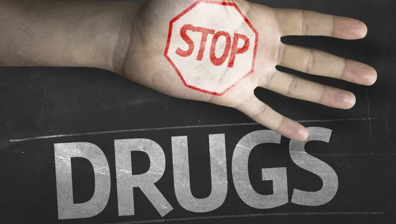
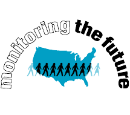
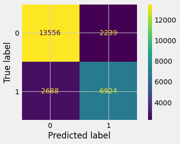

# Predicting Adolescent Drug Use with Machine Learning

<div style="text-align:center"></div>

#### Author: [Jamie Dowat](mailto:jamie_dowat44@yahoo.com)

## Contents

* `src` contains source code to run the `final_notebook.ipynb`.
* `final_notebook.ipynb` contains a detailed description and demonstration of the modeling process for this project, as well as the full list of source material (modeling and otherwise).
* `capstone_presentation.pdf` is a slide deck containing major highlights of the project.

***********
## Business Problem

#### The drug problem in the United States is widespread and growing:

> [Mortality rates](https://jamanetwork.com/journals/jama/article-abstract/2674665) from drug use disorders increased nationally and in every county between 1980 and 2014, but the relative increase varied from 8.2% to 8369.7%.

************

> [**Adolescents**](https://www.drugabuse.gov/news-events/news-releases/2021/03/younger-age-of-first-cann[…]ssociated-with-faster-development-of-substance-use-disorders) are especially vulnerable. After a year since first use of drugs:
        * 11.2% of adolescents had prescription opioid use disorder versus 6.9% of young adults. 
        * 13.9% of adolescents had prescription stimulant use disorder versus 3.9% of young adults. 
        * 11.2% of adolescents had prescription tranquilizer use disorder versus 4.7% of young adults.
        
***********        

## Purpose of Project:

To develop/tune machine learning classifiers in the hopes of more deeply understanding *factors that correlate with drug use*.

For potential deployement the final model from this project has potential to serve as a "barometer" for high schools, who can implement the survey anonymously and gain some high-level data about the state of their school and be able to more precisely analyze trends amongst their students and measure their **prevention efforts** against any changes seen in the model.

## DATA: [Monitoring the Future](www.monitoringthefuture.org)

<div style="text-align:center"></div>

**Monitoring the Future** began in 1975 as an attempt to collect and study drug use and feelings toward drug use amongst adolescents (8th-12th). 

Data consists of **101,658** survey reponses from 12th graders from 133 schools nationwide.

For more information on this study, click [here](http://monitoringthefuture.org/purpose.html).

To download the dataset used in this project, click [here](https://www.kaggle.com/jamiedowat/monitoring-the-future-12th-grade-drug-use-survey).

**Questions** in this dataset are limited to the following:
* Demographic information
* Drug Use Information

*************

## MODELING:

The following models were implemented, along with [Boruta feature selection](https://towardsdatascience.com/boruta-explained-the-way-i-wish-someone-explained-it-to-me-4489d70e154a), [Phi-K](https://phik.readthedocs.io/en/latest/tutorials.html) and Bayesian Optimization.
* Logistic Regression
* Decision Trees
* Random Forests
* XGBoost

###### Models were validated with StratifiedKFolds, dividing the training set into 10 folds.

The **final model** produced an accuracy of **80.6%** and a recall of **72%** (Test Set)

**Recall** was given extra attention as a metric, since false negatives (predicting no drug use when drug use is present) are predictions that would potentially cause the most harm.

### Feature Importances:

In terms of real-life applicability, Logistic Regression ended up being the best choice due to its superior performance and high level of interpretability.

###### TOP 3 Postive Features:
* `YEAR=2019` - `1.122`
* `YEAR=2015` - `0.714`
* `Consumed Alcohol 40+ times in the past year` - `0.655`

###### TOP 3 Negative Features:
* `Consumed NO Alcohol in the past year` - `-1.044`
* `Never Smoked Cigarette` - `-1`
* `Grew up on a Farm` - `-0.577`

#### Final Model: Confusion Matrix

<div style="text-align:center"></div>

************

```

├── img<br>
....├── amenbrain.png
....├── fsm.png
....├── mtf.png
....├── nida.png
....├── samhsa.png
....└── stopdrugs.png
├── src
....├── __init__.py
....├── eda.py
....└── modeling.py
├── capstone_presentation.pdf
├── final_notebook.ipynb
└── README.md
```